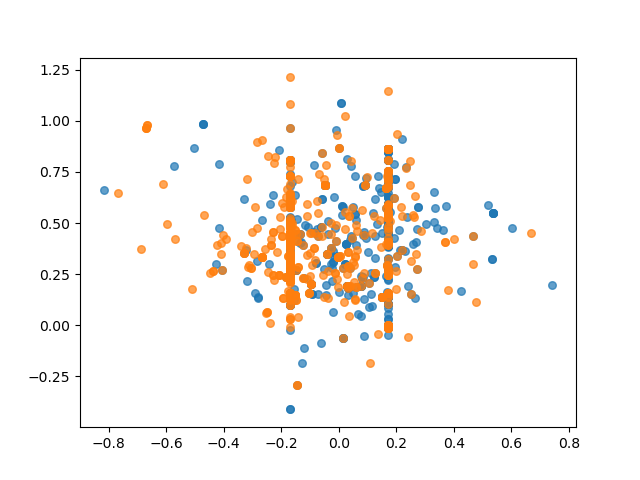

# homeworkForNLPSeminar
Homwork for NLP Seminar in AI School For MS workers, you can see the task in "NLP Seminar FY21 Assignment.docx".

# visualize all vectors
```
python task1.py visualizeVector
```


# use svm to do a classification job
```
python task1.py svm
```

The result is:


Visualize train:


Visualize dev:


Visualize test:

